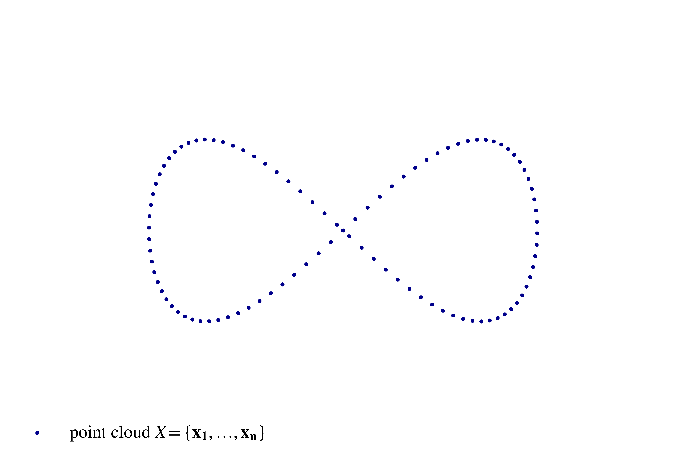
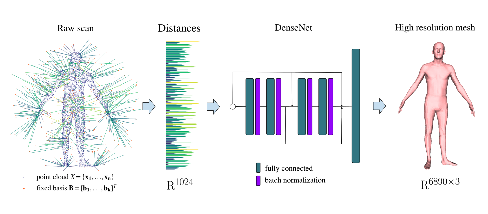

# Efficient Learning on Point Clouds with Basis Point Sets

**Basis Point Set (BPS)** is a simple and efficient method for encoding 3D point clouds into fixed-length 
representations.

It is based on a _**simple idea**_: select k fixed points in space and compute vectors from  these basis points to the nearest
points in the point cloud; use these vectors (or simply their norms) as features:



The basis points are kept fixed for all the point clouds in the dataset, providing a fixed representation of every 
point cloud as a vector. This representation can then be used  as input to arbitrary machine learning methods, in 
particular it can be used as input to off-the-shelf neural networks. 

Below is the example of a simple model using  BPS features as input for the  task of mesh registration over a 
noisy scan:



**FAQ**: key differences between standard occupancy voxels, TSDF and the proposed BPS representation:

- continuous global information instead of simple binary flags or local distances in the cells;
- smaller number of cells in order to represent shape accurately;
- cell arrangements different from a standard rectangular grid;
- significant improvement in performance: simply substituting occupancy voxels with  BPS directional vectors results 
in +9% accuracy improvement of a VoxNet-like Conv3D network on a ModelNet40 classification 
challenge,  exceeding performance of the PointNet\PointNet++ frameworks while having an order of magnitude 
less floating point operations.

 Check our [ICCV 2019 paper](https://arxiv.org/abs/1908.09186) for more 
 details.

## Usage
 
### Requirements

- Python >= 3.7
- scikit-learn >= 0.21
- PyTorch >= 1.3 (for running provided demos)

### Installation


```
pip3 install git+https://github.com/amzn/basis-point-sets
```

### Code snippet


Converting point clouds to BPS representation takes few lines of code:

```
import numpy as np
from bps import bps

# batch of 100 point clouds to convert
x = np.random.normal(size=[100, 2048, 3])

# optional point cloud normalization to fit a unit sphere
x_norm = bps.normalize(x)

# option 1: encode with 1024 random basis and distances as features
x_bps_random = bps.encode(x_norm, bps_arrangement='random', n_bps_points=1024, bps_cell_type='dists')

# option 2: encode with 32^3 grid basis and full vectors to nearest points as features
x_bps_grid = bps.encode(x_norm, bps_arrangement='grid', n_bps_points=32**3, bps_cell_type='deltas')
# the following tensor can be provided as input to any Conv3D network:
x_bps_grid = x_bps_grid.reshape([-1, 32, 32, 32, 3])
```

### Demos

Clone the repository and install the dependencies:

```
git clone https://github.com/amzn/basis-point-sets
cd basis-point-sets
python setup.py install
pip3 install torch h5py
```


Check one of the provided examples:

- **ModelNet40 3D shape classification with BPS-MLP** (~89% accuracy, ~20 minutes of training on a non-GPU MacBook Pro, 
~2 minutes of training on Nvidia V100 16gb):

```
python bps_demos/train_modelnet_mlp.py
```

- **ModelNet40 3D shape classification with BPS-Conv3D** (~92% accuracy, ~60 minutes of training on Nvidia V100 16gb):

```
python bps_demos/train_modelnet_conv3d.py
```

- **Human body mesh registration**: _coming soon_.


## Citation

If you find our work useful in your research, please consider citing:
```
@inproceedings{prokudin2019efficient,
  title={Efficient Learning on Point Clouds With Basis Point Sets},
  author={Prokudin, Sergey and Lassner, Christoph and Romero, Javier},
  booktitle={Proceedings of the IEEE International Conference on Computer Vision},
  pages={4332--4341},
  year={2019}
}
```
## License

This library is licensed under the MIT-0 License. See the LICENSE file.

